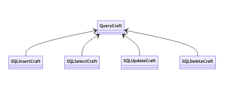

# IOEasier
Rendi più facile gestire l'IO con java!

`version 0.4`


## Usare le classi DB

iniziare la connessione (una tantum nel runtime) tramite `ConnessioneDB` :  

```java
if( ! ConnessioneDB.createInstance("nomeutente","psk")) {
	System.err.println("errore");
	System.exit(-1);
}
```

La connessione resta aperta ad oltranza fino a che non si usa il metodo `destroy` della medesima classe. 

ConnessioneDB è una **classe statica** che non richiede di portarsi un istanza, ma fornisce essa stessa un istanza di java.sql.Connection in singleton.

Alcune query, son fornite con `MySqlConnection`:  

| nome metodo ( parametri input ) | output         | breve spiegazione                                   |
| ------------------------------- | -------------- | --------------------------------------------------- |
| `creaDB( String nomeDB)`        | `boolean`      | crea un DB                                          |
| `existDB( String nomeDB)`       | `boolean`      | resistuisce `true` se esiste il DB                  |
| `dropDB( String nomeDB)`        | `boolean`      | Cancella il db                                      |
| `esegui( String queryCompleta)` | `boolean`      | esegue un istruzione MySql                          |
| `query( String queryCompleta)`  | `ResultSet`    | esegue una query, restituisce il ResultSet          |
| `listDB()`                      | `List<String>` | restituisce la Lista dei DB sotto forma di stringhe |


## QueryCraft

Nel package `psykeco.ioeasier.db.querycraft`  si può trovare un sottosistema di creazione delle query da mandare al DB.
Le istanze di `QueryCraft` sono builder che creano delle query a partire da coppia **chiave-valore** che gli vengono date in pasto.

L'interfaccia espone i metodi:

| **Nome metodo**                                    | **Descrizione**  *(***obbligatorio)*                         |
| -------------------------------------------------- | ------------------------------------------------------------ |
| `DB(String) : QueryCraft`                          | imposta il nome del DB*                                      |
| `table(String) : QueryCraft`                       | imposta il nome della tabella*                               |
| `entry(String column, String value) : QueryCraft`  | imposta una coppia colonna-valore all'operatore principale (select, update, insert, etc...) |
| `filter(String column, String value) : QueryCraft` | imposta una coppia colonna-valore alla where                 |
| `validate() : boolean`                             | valida la query, se false qualche parametro necessario non è stato impostato, oppure qualche valore non ha passato la regex |
| `craft() : String`                                 | costruisce la query sotto forma di stringa                   |

 

Sono inoltre disponibili i seguenti metodi/variabili statiche :

- `str(Object o):String`  :  restituisce la rappresentazione stringa dell'oggetto che verrà messa nel DB
  - nel caso delle stringhe ad esempio verranno aggiunti apici singoli `'`
- `BASE_REGEX : String` : è una variabile che rappresenta la regex che viene applicata ai singoli elementi che son imposti come nome colonna, nome db o nome tabella
- `VALUE_REGEX: STRING` : è una variabile che rappresenta la regex che viene applicata ai singoli elementi che  rappresenteranno i valori nelle query


Al momento son presenti le seguenti implementazioni di QueryCraft:




### exception

| Eccezione                       | messaggio                                                 | quando                                                       |
| ------------------------------- | --------------------------------------------------------- | ------------------------------------------------------------ |
| `UnsupportedOperationException` | SqlInsertCraft does not support filter                    | uso dei metodi filter su SqlInsertCraft (non  ha una where)  |
| `UnsupportedOperationException` | SqlDeleteCraft does not support entry                     | uso dei metodi entry su SqlDeleteCraft ( non ha campi di selezione ) |
| `IllegalArgumentException`      | nome tabella/db necessario                                | Durante la fase di validazione, è stata trovata una tabella o db esistente ( son due messaggi diversi, a seconda di cosa non è stato trovato) |
| `IllegalArgumentException`      | Una chiave/ il valore di una chiave è stata trovato vuoto | Durante la fase di validazione, è stata trovata una chiave o il valore di una chiave vuoti ( son due messaggi diversi, a seconda di cosa non è stato trovato) |
| `IllegalArgumentException`      | Nome tabella/db/chiave/valore non valido                  | Durante la fase di validazione, son stati trovati dei valori di tabella/db/chiave/valore non validi () son quattro messaggi diversi, a seconda di cosa non ha passato la regex) |


## TableCraft 

La `TableCraft` crea le istruzioni per generare tabelle a partire dalle classi java. Per farlo usa la **reflection**.

Espone i seguenti metodi:

| **Nome metodo**                | **Descrizione** *(***obbligatorio)*                          |
| ------------------------------ | ------------------------------------------------------------ |
| `DB(String) : TableCraft`      | imposta il nome del DB *                                     |
| `table(Class) : TableCraft`    | imposta il nome della tabella *                              |
| `suffix(String) : TableCraft`  | imposta un suffisso                                          |
| `prefix(String) : TableCraft`  | imposta un prefisso                                          |
| `primary(String) : TableCraft` | aggiunge una chiave primaria                                 |
| `validate() : boolean`         | valida la query, se false qualche parametro necessario non è stato impostato, oppure qualche valore non ha passato la regex |
| `craft() : String`             | costruisce la query sotto forma di stringa                   |


L'unica implementazione disponibile è quella di `SQLCreateTableCraft`

## Input da Console

La Classe `psykeco.ioeasier.io.Input` fornisce una comoda interfaccia per l'input da tastiera. È una **classe statica**
Esistono i vari metodi `leggi*Tipo` per ogni tipo di java:
- `leggiBool`
- `leggiInt`
- `leggiChar`
- etc...

Due metodi speciali per le stringhe:
- `leggiParola` : legge fino allo spazio
- `leggiFrase` : legge tutta la linea

Inoltre ogni metodo ha un corrispettivo che prende come parametro una stringa, la stampa prima di chiedere l'input. Esempio d'uso:

```java
int x=Input.leggiInt("Inserisci un numero:>");
```

In caso di inserimenti "malevoli" o comunque errati, viene richiesto l'input.

## Gestire al meglio i tuoi File con FileUtility

FileUtility è una **classe statica** che contiene una serie di metodi per regolare la gestione dei file tra i vari sistemi operativi: 

| nome metodo ( parametri input )                              | output         | breve spiegazione                                            |
| ------------------------------------------------------------ | -------------- | ------------------------------------------------------------ |
| `fileSplitter(File, char separatore, int limite)`            | `String[]`     | divide un file di testo in un vettore di Stringhe  di dimensione data, ogni stringa era divisa originariamente dall'altra con il carattere separatore passato |
| `fileUnlimSplitter(File, char separatore)`                   | `List<String>` | divide un file di testo in una lista di Stringhe, ogni stringa era divisa originariamente dall'altra con il carattere separatore passato |
| `fileWriter(String nomeFile, List<String> contenuto , String separatore )` | `void`         | Scrive la lista di stringhe sul file indicato da "nomefile" separando ogni stringa dall'altra con il separatore |
| `fileBack(String suffisso, File originale)`                  | `File`         | crea un file di backup usando come percorso quello originale aggiungendo un suffisso ( valore default suffisso=`.back`) |
| `hideFile(File)`                                             | `boolean`      | Nasconde il file dato ( se non nascosto )                    |
| `showFile(File)`                                             | `boolean`      | Mostra il file dato (se nascosto)                            |
| `hiddenFileName(File originale)`                             | `File`         | Restituisce un file con il nome che avrebbe se fosse nascosto ( nei sistemi UNIX con un `.` davanti) |
| `showFileName(File)`                                         | `File`         | Restituisce un file con il nome che avrebbe se non fosse nascosto ( nei sistemi UNIX senza  `.` davanti) |
| `deleteFile(File, String argomenti)`                         | `boolean`      | Elimina un file, si possono passare argomenti (vedi [argomenti deleteFile](###argomenti-deleteFile) ) |
| `selectOS()`                                                 | `SistemaOperativo`       | restituisce il [Sistema Operativo](###la-enum-SistemaOperativo)                   |
| `listFile(File directory)`                                   | `String[]`     | restituisce un vettore di String di file presenti nella cartella |
| `listVisibleFile(File directory)`                            | `String[]`     | restituisce un vettore di String di file presenti nella cartella ( ma non quelli nascosti ) |
| `textFileWriter(String, LinkedList<String>, String)`         | `void`         | Scrive la lista di stringhe sul file indicato da "nomefile" separando ogni stringa dall'altra con il separatore |
| `creaFileEParenti(File)`                                     | `boolean`      | Crea il file ed eventualmente le cartelle che lo contengono  |
| `nascostoInWindows(File)`                                    | `boolean`      | restituisce `true` se il sistema operativo è **windows** e il file è **nascosto** |
| `absolutePathOf(String, Class)`                              | `String`       | restituisce il path assoluto della classe o del jar in cui è eseguita la classe |
| `getExecJar(Class)`                                          | `File`         | restituisce la cartella o il Jar che contiene la classe      |
| `getJarName(Class)`                                          | `String`       | restituisce il nome della cartella o del Jar che contiene la classe |

### argomenti deleteFile

- `-r` : rimuove ricorsivamente

### la enum SistemaOperativo

Contiene i valori:

- `WINDOWS`
- `LINUX`
- `MAC`
- `UNIX_GENERICO`
- `OTHER`


# TODO 
- QueryCraft : documentazione
- QueryCraft : join e filterJ (filter on join) 
- QueryCraft : gestire Date e GregorianCalendar
- QueryCraft : UNIT TEST
- MySqlConnection : Generare valore di ritorno
- MySqlConnection : gestire Messaggi di Errore
- MySqlConnection : UNIT TEST 
